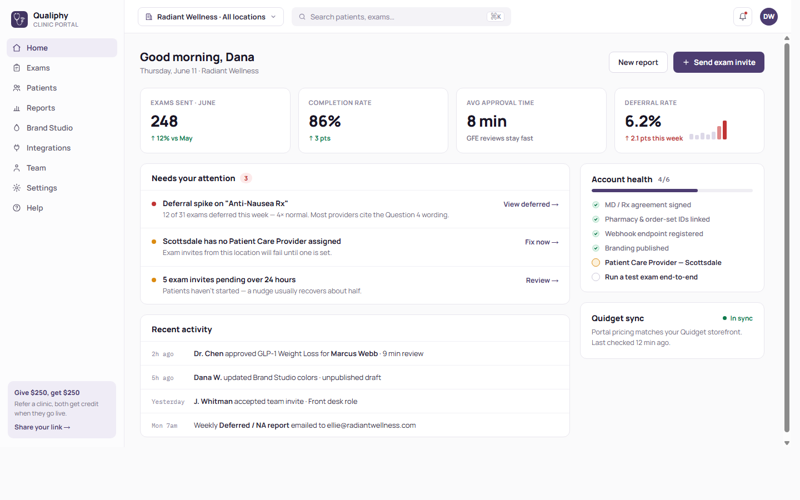

# Qualiphy Clinic Portal — Reimagined

A ground-up redesign of the Qualiphy clinic-facing portal, built as a **private internal design playground / demo** (Noah · Tom · Brent). Not production code — a semi-functional prototype for playing with designs and productizing ideas.

**All data is 100% fabricated** — fake clinic ("Radiant Wellness", Scottsdale / Tempe / Mesa), fake patients, fake exams. No real patient data, ever (HIPAA).



## What's in here

| Path | What it is |
| --- | --- |
| `v1/` | The working demo — Vite + React SPA, no backend, JSON fixtures |
| `docs/screenshots/` | Rendered screens (headless-browser captures of the actual build) |

**Live demo:** https://sirbrentz.github.io/qualiphy-clinic-portal/

## Run it

```bash
cd v1
npm install
npm run dev      # local dev server
npm run build    # static build → v1/dist
```

Deep links work via hash: `/#exams`, `/#brand`, `/#reports`, etc.

## The demo storyline (walkthrough script)

1. **Home** — KPIs, "Needs attention" queue. Click the **deferral-spike alert** → lands on Exams filtered to Deferred.
2. **Exams** — status tabs with live counts, search, bulk select → **Export selection** downloads a real CSV. Click Maya Reynolds' row → slide-over with deferral reason + timeline → **View patient**.
3. **Patients** — patient-centric history (net-new concept vs. the current portal).
4. **Reports** — self-serve report builder: Deferred/NA template, row count, test-mode exclusion banner, **Export CSV** (real download, "no row caps").
5. **Brand Studio** — opens intentionally broken (white-on-white text). Publishing is **blocked by a real WCAG contrast check**; "Fix automatically" clears it. This productizes a real support incident.
6. **Exam Library** — "Edit locations" / "Duplicate safely" open an **impact-summary modal** (productizes the silent location-wipe bug).
7. **Settings ▸ Locations** — Scottsdale has no Patient Care Provider; **Assign provider** actually resolves it.
8. **Team ▸ Audit log** — every change recorded, nothing silent.

## Why these features

Each "new" capability maps to a documented real-world pain point (manual export tickets, silent exam-edit breakage, invisible white-label text, deferral opacity, PCP config failures). The full evidence-backed redesign brief is kept internally.

---

🤖 Built with [Claude Code](https://claude.com/claude-code) from a Claude-designed handoff. Internal use only.
